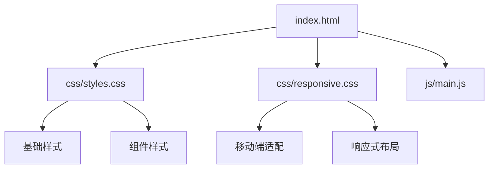

# 设计文档

## 概述

本设计文档描述了如何将当前的单体index.html文件进行模块化重构，将内联样式提取到外部CSS文件，同时确保部署后样式和功能的完整性。重构将采用渐进式方法，保持现有功能的同时提升代码的可维护性。

## 架构

### 当前架构分析
- **单体HTML文件**：所有样式内联在`<style>`标签中（约800行CSS代码）
- **外部资源**：已有css/styles.css和css/responsive.css文件，但未被充分利用
- **JavaScript**：已模块化在js/main.js中
- **响应式设计**：包含3个主要断点（768px、480px、360px）

### 目标架构
```
index.html (精简的HTML结构)
├── css/
│   ├── styles.css (主要样式 + 内联样式迁移)
│   └── responsive.css (响应式样式)
├── js/
│   └── main.js (现有JavaScript功能)
└── 其他资源文件
```

## 组件和接口

### CSS模块组织结构

#### 1. 基础样式模块
- **重置样式**：通用重置和基础字体设置
- **容器样式**：.container类和基础布局
- **通用动画**：@keyframes定义（float、bounce）

#### 2. 组件样式模块
按页面区域组织：
- **Hero区域**：渐变背景、标题样式、动画效果
- **品牌说明区域**：卡片布局、徽章样式
- **数据迁移区域**：步骤卡片、按钮样式
- **功能展示区域**：网格布局、悬停效果
- **下载区域**：按钮样式、提示框
- **页脚**：简单布局样式

#### 3. 响应式样式模块
- **平板适配**：768px断点
- **手机适配**：480px断点
- **超小屏适配**：360px断点
- **横屏优化**：landscape媒体查询

### 文件引用策略

#### HTML文件结构
```html
<head>
    <!-- 元数据和SEO标签 -->
    <meta charset="utf-8">
    <meta name="viewport" content="width=device-width, initial-scale=1.0">
    <!-- 外部样式表引用 -->
    <link rel="stylesheet" href="css/styles.css">
    <link rel="stylesheet" href="css/responsive.css">
</head>
<body>
    <!-- 页面内容 -->
    <script src="js/main.js"></script>
</body>
```

#### CSS文件合并策略
1. **保留现有css/responsive.css**：已有的响应式样式
2. **扩展css/styles.css**：合并内联样式和现有外部样式
3. **确保加载顺序**：styles.css先加载，responsive.css后加载以覆盖基础样式

## 数据模型

### 样式分类映射
```
内联样式 -> 外部文件映射：
├── 基础样式 (*, body, .container) -> css/styles.css
├── Hero区域样式 (.hero, .hero::before, @keyframes) -> css/styles.css
├── 品牌区域样式 (.brand-*) -> css/styles.css
├── 迁移区域样式 (.migration-*) -> css/styles.css
├── 功能区域样式 (.features, .feature-*) -> css/styles.css
├── 下载区域样式 (.download-*) -> css/styles.css
├── 页脚样式 (footer) -> css/styles.css
└── 响应式样式 (@media queries) -> css/responsive.css (合并现有)
```

### 文件依赖关系


## 错误处理

### CSS加载失败处理
1. **关键样式内联备份**：保留最基础的样式在HTML中作为fallback
2. **资源路径验证**：确保相对路径在不同部署环境下正确
3. **浏览器兼容性**：保持现有的CSS兼容性前缀

### 部署环境适配
1. **相对路径策略**：所有资源使用相对路径引用
2. **文件完整性检查**：确保所有引用的文件存在
3. **MIME类型支持**：确保服务器正确识别CSS文件类型

## 测试策略

### 功能测试
1. **视觉回归测试**：对比重构前后的页面截图
2. **响应式测试**：在不同设备尺寸下验证布局
3. **动画效果测试**：验证所有CSS动画正常工作
4. **交互功能测试**：验证JavaScript功能不受影响

### 性能测试
1. **加载时间测试**：对比重构前后的页面加载速度
2. **资源大小测试**：验证CSS文件大小合理
3. **缓存效果测试**：验证外部CSS文件可被浏览器缓存

### 兼容性测试
1. **浏览器兼容性**：在主流浏览器中测试
2. **移动端兼容性**：在不同移动设备上测试
3. **网络环境测试**：在不同网络条件下测试加载

### 部署测试
1. **本地服务器测试**：使用本地HTTP服务器测试
2. **生产环境模拟**：模拟真实部署环境测试
3. **CDN兼容性测试**：如果使用CDN，验证资源加载正确

## 实施计划

### 阶段1：样式提取和文件重组
- 提取内联CSS到外部文件
- 合并和优化现有CSS文件
- 更新HTML文件的样式引用

### 阶段2：代码优化和清理
- 优化CSS代码结构和注释
- 移除重复样式规则
- 验证样式优先级正确

### 阶段3：测试和验证
- 进行全面的功能和视觉测试
- 验证在不同环境下的部署效果
- 性能优化和最终调整